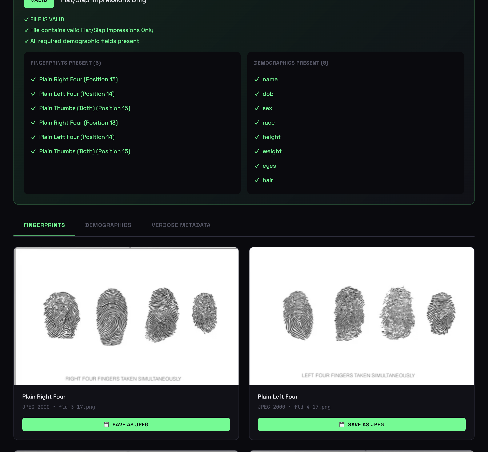

# 🔍 EFT Fingerprint Viewer

A lightweight, web-based viewer for Electronic Fingerprint Transmission (EFT) files. This tool parses ANSI/NIST-ITL formatted biometric files, extracts fingerprint images, displays demographic information, and validates file completeness against EBTS requirements.



## ✨ Features

- **📁 File Support**: Drag-and-drop or browse for `.eft` files
- **🖼️ Image Extraction**: Automatically decodes JP2 (JPEG 2000) and WSQ compressed fingerprints
- **👤 Demographics Display**: Shows subject information (name, DOB, physical descriptors, address)
- **📋 Metadata Viewer**: Complete verbose metadata with all ANSI/NIST fields
- **✅ Validation**: Validates EFT files against FBI EBTS requirements
- **💾 Export**: Save fingerprint images as JPEG files
- **🎨 Modern UI**: Dark theme with responsive design

## 📋 Table of Contents

- [Requirements](#-requirements)
- [Installation](#-installation)
- [Quick Start](#-quick-start)
- [Usage](#-usage)
- [EFT File Format](#-eft-file-format)
- [Validation Rules](#-validation-rules)
- [Architecture](#-architecture)
- [Dependencies & Credits](#-dependencies--credits)
- [Troubleshooting](#-troubleshooting)
- [License](#-license)

## 💻 Requirements

### System Requirements
- **Operating System**: macOS, Linux, or Windows (with WSL)
- **Python**: 3.8 or higher
- **Disk Space**: ~100MB for NBIS tools

### Required Tools
- **NIST NBIS** (Biometric Image Software) - for parsing ANSI/NIST files
- **OpenJPEG** - for decoding JPEG 2000 images
- **Python 3** - for the backend server

## 🚀 Installation

### Option 1: Automated Setup (Recommended)

```bash
# Clone the repository
git clone https://github.com/YOUR_USERNAME/eft-fingerprint-viewer.git
cd eft-fingerprint-viewer

# Run the setup script
./setup.sh
```

### Option 2: Manual Installation

#### Step 1: Install OpenJPEG

**macOS (Homebrew):**
```bash
brew install openjpeg
```

**Ubuntu/Debian:**
```bash
sudo apt-get install libopenjp2-tools
```

**Windows (WSL):**
```bash
sudo apt-get install libopenjp2-tools
```

#### Step 2: Build NIST NBIS

```bash
# Clone NBIS source
git clone https://github.com/biometric-technologies/nist-biometric-image-software-nbis.git nbis-src

# Build NBIS (use a path without spaces)
cd nbis-src
mkdir -p /tmp/nbis-build
./setup.sh /tmp/nbis-build --without-X11 --STDLIBS
make config
make it
make install LIBNBIS=no

# Verify installation
/tmp/nbis-build/bin/an2ktool -version
```

#### Step 3: Install Python Dependencies

```bash
pip3 install -r requirements.txt
```

## 🎯 Quick Start

1. **Start the server:**
   ```bash
   python3 server.py
   ```

2. **Open your browser:**
   ```
   http://localhost:8888
   ```

3. **Load an EFT file:**
   - Drag and drop a `.eft` file onto the drop zone, OR
   - Click to browse and select a file, OR
   - Click "Load Test File" to use the included sample

## 📖 Usage

### Loading Files

The viewer accepts `.eft` files in ANSI/NIST-ITL format (commonly used for FBI/ATF fingerprint submissions).

**Supported compression types:**
- **JP2** (JPEG 2000) - ✅ Fully supported
- **WSQ** (Wavelet Scalar Quantization) - ✅ Fully supported

### Viewing Results

#### Fingerprints Tab
- Displays extracted fingerprint images
- Shows finger position labels (Plain Right Four, Plain Left Four, Plain Thumbs, etc.)
- "Save as JPEG" button for each image

#### Demographics Tab
- Subject information: Name, DOB, Sex, Race
- Physical descriptors: Height, Weight, Eye Color, Hair Color
- Transaction details: Reason Fingerprinted, Date, Address

#### Verbose Metadata Tab
- Complete listing of all ANSI/NIST fields
- Organized by record type (Type-1, Type-2, Type-14, etc.)
- Raw field values for debugging

### Validation Panel

The validation panel shows:
- **VALID** (green) - File meets EBTS requirements
- **INCOMPLETE** (amber) - Missing required fingerprints or demographics

**Validation checks:**
- Required fingerprint positions present
- Required demographic fields populated
- Transaction type requirements met

## 📄 EFT File Format

EFT files follow the **ANSI/NIST-ITL 1-2011** standard and **FBI EBTS** (Electronic Biometric Transmission Specification).

### Record Types

| Type | Description | Contents |
|------|-------------|----------|
| **Type-1** | Transaction Information | Header, dates, agency info |
| **Type-2** | User-Defined Descriptive | Demographics, subject info |
| **Type-4** | Grayscale Fingerprint | Legacy fingerprint images |
| **Type-14** | Variable Resolution Fingerprint | Modern fingerprint images |

### Finger Positions

| Position | Description |
|----------|-------------|
| 1-10 | Individual rolled fingerprints (R. Thumb through L. Little) |
| 11 | Plain Right Thumb |
| 12 | Plain Left Thumb |
| 13 | Plain Right Four Fingers |
| 14 | Plain Left Four Fingers |
| 15 | Plain Thumbs (Both) |

## ✅ Validation Rules

The viewer validates against FBI EBTS requirements for **FAUF** (Applicant Fingerprint) transactions:

### Fingerprint Requirements (one of)
1. **Complete FD-258**: All 10 rolled prints + 3 slaps (positions 1-10, 13-15)
2. **Rolled Prints Only**: All 10 individual fingerprints (positions 1-10)
3. **Flat/Slap Impressions Only**: 3 plain impressions (positions 13, 14, 15)

### Required Demographics
- Name
- Date of Birth
- Sex
- Race
- Height
- Weight
- Eye Color
- Hair Color

## 🏗️ Architecture

```
┌─────────────────────────────────────────────────────────────┐
│                     Browser (Frontend)                       │
│  ┌─────────────┐  ┌──────────────┐  ┌───────────────────┐  │
│  │  index.html │  │  JavaScript  │  │    CSS Styles     │  │
│  │  (UI/UX)    │  │  (Logic)     │  │    (Dark Theme)   │  │
│  └─────────────┘  └──────────────┘  └───────────────────┘  │
└────────────────────────────┬────────────────────────────────┘
                             │ HTTP (port 8888)
                             ▼
┌─────────────────────────────────────────────────────────────┐
│                   Python Backend (server.py)                 │
│  ┌─────────────┐  ┌──────────────┐  ┌───────────────────┐  │
│  │  File       │  │  Metadata    │  │    Validation     │  │
│  │  Upload     │  │  Parsing     │  │    Engine         │  │
│  └─────────────┘  └──────────────┘  └───────────────────┘  │
└────────────────────────────┬────────────────────────────────┘
                             │ subprocess
                             ▼
┌─────────────────────────────────────────────────────────────┐
│                      NBIS Tools                              │
│  ┌─────────────┐  ┌──────────────┐  ┌───────────────────┐  │
│  │  an2ktool   │  │    dwsq      │  │   opj_decompress  │  │
│  │  (Parser)   │  │  (WSQ→Raw)   │  │   (JP2→PNG)       │  │
│  └─────────────┘  └──────────────┘  └───────────────────┘  │
└─────────────────────────────────────────────────────────────┘
```

### API Endpoints

| Endpoint | Method | Description |
|----------|--------|-------------|
| `/` | GET | Serve the web interface |
| `/api/health` | GET | Check server status and NBIS availability |
| `/api/parse` | POST | Parse EFT file and extract images |

## 🙏 Dependencies & Credits

### Core Dependencies

#### NIST NBIS (Biometric Image Software)
- **Repository**: [biometric-technologies/nist-biometric-image-software-nbis](https://github.com/biometric-technologies/nist-biometric-image-software-nbis)
- **Original Source**: [NIST](https://www.nist.gov/services-resources/software/nist-biometric-image-software-nbis)
- **License**: Public Domain
- **Used for**: Parsing ANSI/NIST files, WSQ decompression

#### OpenJPEG
- **Website**: [openjpeg.org](https://www.openjpeg.org/)
- **Repository**: [uclouvain/openjpeg](https://github.com/uclouvain/openjpeg)
- **License**: BSD-2-Clause
- **Used for**: JPEG 2000 decompression

#### OpenEFT (Reference)
- **Repository**: [NoahGWood/OpenEFT](https://github.com/NoahGWood/OpenEFT)
- **License**: GPL-3.0
- **Used for**: Understanding EFT file generation and structure

### Python Dependencies
- Python 3.8+ (standard library only, no external packages required)

### Frontend Dependencies
- **Fonts**: JetBrains Mono, Space Grotesk (Google Fonts)
- No JavaScript frameworks required (vanilla JS)

## 🔧 Troubleshooting

### "NBIS Backend Disconnected"

**Cause**: The Python server isn't running or NBIS tools aren't found.

**Solution**:
```bash
# Start the server
python3 server.py

# Verify NBIS is installed
/tmp/nbis-build/bin/an2ktool -version
```

### "Failed to decode image"

**Cause**: Missing OpenJPEG or corrupted image data.

**Solution**:
```bash
# Verify OpenJPEG is installed
which opj_decompress

# Install if missing (macOS)
brew install openjpeg
```

### Fingerprints appear as black boxes

**Cause**: WSQ compression without NBIS dwsq tool.

**Solution**: Ensure NBIS is fully built and `dwsq` is available:
```bash
/tmp/nbis-build/bin/dwsq -version
```

### Port 8888 already in use

**Solution**:
```bash
# Find and kill the process
lsof -ti:8888 | xargs kill -9

# Or use a different port
python3 server.py --port 9000
```

## 📁 Project Structure

```
eft-fingerprint-viewer/
├── index.html          # Frontend UI (single-page application)
├── server.py           # Python backend server
├── requirements.txt    # Python dependencies
├── setup.sh           # Automated installation script
├── README.md          # This documentation
├── LICENSE            # MIT License
├── .gitignore         # Git ignore rules
├── test_FD-258/       # Sample test files
│   └── *.eft          # Test EFT files
├── docs/              # Documentation assets
│   └── screenshot.png # App screenshot
└── output/            # Extracted images (gitignored)
```

## 📜 License

This project is licensed under the **MIT License** - see the [LICENSE](LICENSE) file for details.

### Third-Party Licenses
- **NBIS**: Public Domain (US Government work)
- **OpenJPEG**: BSD-2-Clause
- **OpenEFT**: GPL-3.0 (reference only, not included)

## 🤝 Contributing

Contributions are welcome! Please feel free to submit a Pull Request.

1. Fork the repository
2. Create your feature branch (`git checkout -b feature/AmazingFeature`)
3. Commit your changes (`git commit -m 'Add some AmazingFeature'`)
4. Push to the branch (`git push origin feature/AmazingFeature`)
5. Open a Pull Request

## 📧 Contact

For questions or support, please open an issue on GitHub.

---

**Disclaimer**: This tool is for viewing and validating EFT files. It is not affiliated with the FBI, ATF, or any government agency. Always verify submissions through official channels.
